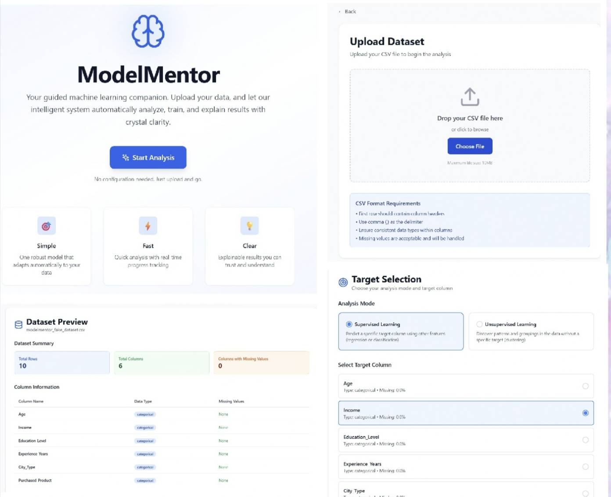
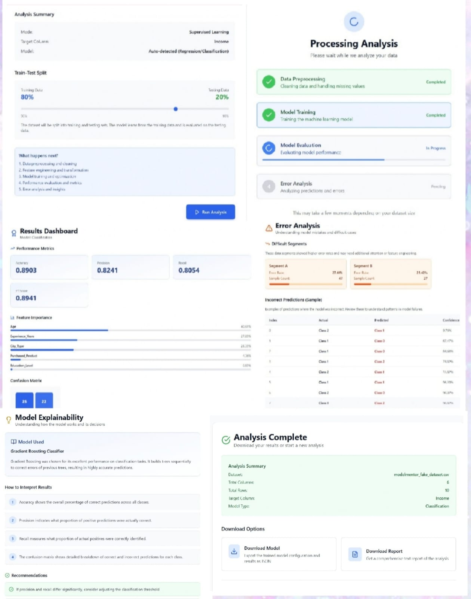

<div align="center">
<h1>🧠 ModelMentor</h1> 

### Intelligent Machine Learning Dashboard

Upload • Analyze • Train • Explain

A modern web application that automates the machine learning workflow through an intuitive dashboard.

</div>

## 📖 About

ModelMentor is a web-based machine learning dashboard that enables users to upload datasets, configure machine learning tasks, train predictive models, and interpret results—all through a clean and user-friendly interface.

The application Simulates a complete machine learning workflow through an interactive dashboard while providing detailed visualizations, performance metrics, feature importance, and model explainability.

## ✨ Features

- 📂 Upload CSV datasets
- 📊 Automatic dataset preview
- 📈 Dataset statistics
- 🔍 Missing value detection
- 🎯 Supervised & Unsupervised Learning
- ⚙ Adjustable Train-Test Split
- 🤖 Automatic model selection
- 📉 Performance Metrics
- 📊 Feature Importance
- 🔥 Confusion Matrix
- ⚠ Error Analysis
- 💡 Model Explainability
- 📱 Responsive UI

## 📸 Application Showcase

<p align="center">
  
  
</p>


## ⚙ Workflow

```text
Upload CSV Dataset
        │
        ▼
Dataset Preview
        │
        ▼
Select Analysis Mode
        │
        ▼
Choose Target Column
        │
        ▼
Configure Parameters
        │
        ▼
Train Machine Learning Model
        │
        ▼
Evaluate Performance
        │
        ▼
Error Analysis
        │
        ▼
Model Explainability
```

## 🛠️ Tech Stack

### Frontend

* React.js
* JavaScript (ES6+)
* Tailwind CSS
* HTML5
* CSS3

### Backend

* Supabase

### Development Tools

* Vite
* ESLint
* Git
* GitHub
* Visual Studio Code

### Data Handling

* CSV File Upload
* Data Preview & Validation
* Interactive Dashboard
* Dynamic Charts & Visualizations


## 📂 Project Structure

ModelMentor/
│
├── public/
├── screenshots/
├── src/
├── supabase/
├── .gitignore
├── README.md
├── package.json
├── vite.config.js
├── tailwind.config.js
├── postcss.config.js
└── eslint.config.js

## 📈 Future Improvements

- 🔐 Authentication
- 📄 Export PDF Reports
- 📊 Compare Multiple Models
- 🌙 Dark Mode
- ☁ Cloud Deployment
- 📜 Analysis History
- 🤖 Additional ML Algorithms

## 👨‍💻 Author

**Vani Jain**

⭐ If you found this project useful, consider giving it a star.
